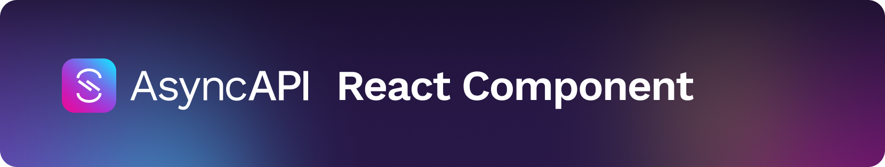

<h5 align="center">
  
  <br>
  React Component
</h5>
<h4 align="center">A official React component for AsyncAPI 2.0 specification</h4>

---

[](#contributors)

## Overview

A official [React](https://reactjs.org/) component for AsyncAPI 2.0 specification. It allows you to render the documentation of your asynchronous API provided in the AsyncAPI specification format and validate this specification. You can fully restyle the component using your own styles.

> **CAUTION**: This package only supports AsyncAPI 2.0 specification. If you use 1.x, we recommend that you upgrade to the latest AsyncAPI version using the [Node.js](https://github.com/asyncapi/converter) or [Go](https://github.com/asyncapi/converter-go) converters.

## Playground

This repository comes in with a [Playground application](https://asyncapi.github.io/asyncapi-react/). Test it to see the component in action and play with it before you use it in your application.

You can also run the Playground application locally by following [this](./docs/development/guide.md#install-dependencies) instruction from the development guide.

## Prerequisites

- [`react`](https://github.com/facebook/react/) (version 16.8.0 or higher)

## Installation

Run this command to install the component in your project:

```sh
npm install --save @kyma-project/asyncapi-react
```

Check out this simple sandbox application that uses the asyncapi-react component:

[](https://codesandbox.io/s/asyncapi-react-in-action-forked-2pd1f)

### Props

The list of props for the AsyncAPI React component includes:

- **schema: string | AsyncApiInterface | FetchingSchemaInterface**

  The `schema` property is required and contains AsyncAPI specification. Use the `string` type, the [`AsyncApiInterface`](./library/src/types.ts#L13) type, or the [`FetchingSchemaInterface`](./library/src/helpers/fetchSchema.ts#L1) object to fetch the schema from an external resource. For more information on what it contains and what it should look like, read [AsyncAPI Specification](https://github.com/asyncapi/asyncapi#asyncapi-specification).

- **config?: Partial<ConfigInterface\>**

  The `config` property is optional and contains configuration for the AsyncAPI component. For more information on the available configuration options, read the [Configuration Modification](./docs/configuration/config-modification.md) document.
  This property is concatenated with the [default configuration](./library/src/config/default.ts).

  > **NOTE:** The `Partial<T>` type means that every field in the `T` type is optional.

### Features

For a list and description of features offered by the AsyncAPI React component, see [this](./docs/features) directory.

### Styles

To use default styles based on [SAP Fundamentals](https://sap.github.io/fundamental/), import them as follows:

``` js
import "@kyma-project/asyncapi-react/lib/styles/fiori.css";
```

For information on how to change styles, read the [Style Modification](./docs/configuration/style-modification.md) document.

## Web Component

If you are not using the React you may want to use the `@kyma-project/asyncapi-react` component as a plain web component. This is achieved by making use of [web-react-components](https://www.npmjs.com/package/web-react-components).

### Installation

Run this command to install the component in your project:

```sh
npm install --save @kyma-project/asyncapi-web-component
```

### Using in Angular

To using component in Angular, follows these steps:

1. Update `AppModule` with adding the `CUSTOM_ELEMENTS_SCHEMA` to `schemas` array in the `NgModule` metadata:

  ```ts
  import { NgModule, CUSTOM_ELEMENTS_SCHEMA } from '@angular/core';

  @NgModule({
    ...
    schemas: [
      CUSTOM_ELEMENTS_SCHEMA,
    ]
  })
  export class AppModule {}
  ```

2. Import the `@kyma-project/asyncapi-web-component` module in an Angular's component where you to want use the web component: 

  ```ts
  import { Component } from '@angular/core';
  import '@kyma-project/asyncapi-web-component/lib/async-api-web-component';

  @Component({
    selector: 'app-root',
    templateUrl: './app.component.html',
    styleUrls: ['./app.component.css']
  })
  export class AppComponent {
    ...
  }
  ```

3. Use web-component in the template as follow:

  ```html
  <async-api-component [schema]="schema" [config]="config" [cssImportPath]="cssImportPath"></async-api-component>
  ```
 
  where:
  
  - `schema` is a `schema` property from React component,
  - `config` is a `config` property from React component,
  - `cssImportPath` is the path to styles. By default it is `assets/fiori.css`

  > **NOTE**: The easiest way to use the default css is to copy the content of the `@kyma-project/asyncapi-react/lib/styles/fiori.css` file to a file `assets/asyncapi.css`.

## Development

For information on how to set up a development environment, write and run tests, follow the naming and architecture convention defined for the project in the [Development Guide](./docs/development/guide.md).

## Releasing

For information on how to release a new version of the library or the playground application, or details on creating a changelog file, read the [Releasing](./docs/development/releasing.md) document.

## Contribution

If you have a feature request, add it as an issue or propose changes in a pull request (PR).
If you create a feature request, use the dedicated **Feature request** issue template. When you create a PR, follow the contributing rules described in the [`CONTRIBUTING.md`](CONTRIBUTING.md) document.

If you have a bug to report, reproduce it in an online code editor. For example, use [CodeSandbox](https://codesandbox.io/). Attach the link to the reproduced bug to your issue. Log the bug using the **Bug report** template.

## Missing features

See the list of features that are still missing in the component:

- [ ] render [`bindings`](https://github.com/asyncapi/asyncapi/blob/master/versions/2.0.0/asyncapi.md#fixed-fields-19)
- [ ] render [`tags`](https://github.com/asyncapi/asyncapi/blob/master/versions/2.0.0/asyncapi.md#tagsObject)
- [ ] render [`externalDocs`](https://github.com/asyncapi/asyncapi/blob/master/versions/2.0.0/asyncapi.md#externalDocumentationObject)
- [ ] render [`schema properties`](https://github.com/asyncapi/asyncapi/blob/master/versions/2.0.0/asyncapi.md#properties) 
- [ ] render [`correlationID`](https://github.com/asyncapi/asyncapi/blob/master/versions/2.0.0/asyncapi.md#correlationIdObject)

If you want to help us develop them, feel free to contribute.

## Credits

<p align="center">
 <a href="https://kyma-project.io/" target="_blank">
  
 </a>
</p>

## Contributors

Thanks goes to these wonderful people ([emoji key](https://github.com/all-contributors/all-contributors#emoji-key)):

<!-- ALL-CONTRIBUTORS-LIST:START - Do not remove or modify this section -->
<!-- prettier-ignore-start -->
<!-- markdownlint-disable -->
<table>
  <tr>
    <td align="center"><a href="https://github.com/magicmatatjahu"><br /><sub><b>Maciej Urbańczyk</b></sub></a><br /><a href="https://github.com/asyncapi/asyncapi-react/commits?author=magicmatatjahu" title="Code">💻</a> <a href="https://github.com/asyncapi/asyncapi-react/commits?author=magicmatatjahu" title="Documentation">📖</a> <a href="#ideas-magicmatatjahu" title="Ideas, Planning, & Feedback">🤔</a> <a href="#maintenance-magicmatatjahu" title="Maintenance">🚧</a> <a href="https://github.com/asyncapi/asyncapi-react/pulls?q=is%3Apr+reviewed-by%3Amagicmatatjahu" title="Reviewed Pull Requests">👀</a> <a href="https://github.com/asyncapi/asyncapi-react/commits?author=magicmatatjahu" title="Tests">⚠️</a></td>
    <td align="center"><a href="https://github.com/kazydek"><br /><sub><b>Karolina Zydek</b></sub></a><br /><a href="https://github.com/asyncapi/asyncapi-react/commits?author=kazydek" title="Documentation">📖</a> <a href="https://github.com/asyncapi/asyncapi-react/pulls?q=is%3Apr+reviewed-by%3Akazydek" title="Reviewed Pull Requests">👀</a> <a href="#maintenance-kazydek" title="Maintenance">🚧</a></td>
    <td align="center"><a href="https://github.com/akucharska"><br /><sub><b>Agata</b></sub></a><br /><a href="https://github.com/asyncapi/asyncapi-react/commits?author=akucharska" title="Code">💻</a> <a href="#maintenance-akucharska" title="Maintenance">🚧</a></td>
    <td align="center"><a href="http://resume.github.io/?derberg"><br /><sub><b>Lukasz Gornicki</b></sub></a><br /><a href="https://github.com/asyncapi/asyncapi-react/commits?author=derberg" title="Documentation">📖</a> <a href="#example-derberg" title="Examples">💡</a> <a href="#ideas-derberg" title="Ideas, Planning, & Feedback">🤔</a></td>
    <td align="center"><a href="https://github.com/aerfio"><br /><sub><b>Mateusz Puczyński</b></sub></a><br /><a href="https://github.com/asyncapi/asyncapi-react/commits?author=aerfio" title="Code">💻</a> <a href="https://github.com/asyncapi/asyncapi-react/commits?author=aerfio" title="Documentation">📖</a> <a href="#ideas-aerfio" title="Ideas, Planning, & Feedback">🤔</a> <a href="#maintenance-aerfio" title="Maintenance">🚧</a> <a href="https://github.com/asyncapi/asyncapi-react/pulls?q=is%3Apr+reviewed-by%3Aaerfio" title="Reviewed Pull Requests">👀</a> <a href="https://github.com/asyncapi/asyncapi-react/commits?author=aerfio" title="Tests">⚠️</a></td>
    <td align="center"><a href="https://www.hash-tech.ch"><br /><sub><b>Hesyar Uzuner</b></sub></a><br /><a href="https://github.com/asyncapi/asyncapi-react/issues?q=author%3Ahesyar" title="Bug reports">🐛</a> <a href="https://github.com/asyncapi/asyncapi-react/commits?author=hesyar" title="Code">💻</a></td>
    <td align="center"><a href="https://marcusilgner.com"><br /><sub><b>Marcus Ilgner</b></sub></a><br /><a href="https://github.com/asyncapi/asyncapi-react/issues?q=author%3Amilgner" title="Bug reports">🐛</a> <a href="https://github.com/asyncapi/asyncapi-react/commits?author=milgner" title="Code">💻</a></td>
  </tr>
  <tr>
    <td align="center"><a href="https://github.com/dhenneke"><br /><sub><b>Dominik Henneke</b></sub></a><br /><a href="https://github.com/asyncapi/asyncapi-react/commits?author=dhenneke" title="Code">💻</a></td>
    <td align="center"><a href="https://github.com/Fox32"><br /><sub><b>Oliver Sand</b></sub></a><br /><a href="https://github.com/asyncapi/asyncapi-react/commits?author=Fox32" title="Code">💻</a></td>
    <td align="center"><a href="https://github.com/JakubIwanowski"><br /><sub><b>Jakub Iwanowski</b></sub></a><br /><a href="https://github.com/asyncapi/asyncapi-react/commits?author=JakubIwanowski" title="Code">💻</a></td>
    <td align="center"><a href="https://github.com/depimomo"><br /><sub><b>depimomo</b></sub></a><br /><a href="https://github.com/asyncapi/asyncapi-react/commits?author=depimomo" title="Tests">⚠️</a></td>
    <td align="center"><a href="https://github.com/sanskar-p"><br /><sub><b>Sanskar Patro</b></sub></a><br /><a href="https://github.com/asyncapi/asyncapi-react/commits?author=sanskar-p" title="Code">💻</a></td>
    <td align="center"><a href="https://github.com/DanielChuDC"><br /><sub><b>danielchu</b></sub></a><br /><a href="#infra-DanielChuDC" title="Infrastructure (Hosting, Build-Tools, etc)">🚇</a></td>
    <td align="center"><a href="http://www.fmvilas.com"><br /><sub><b>Fran Méndez</b></sub></a><br /><a href="https://github.com/asyncapi/asyncapi-react/commits?author=fmvilas" title="Code">💻</a> <a href="#maintenance-fmvilas" title="Maintenance">🚧</a></td>
  </tr>
</table>

<!-- markdownlint-enable -->
<!-- prettier-ignore-end -->
<!-- ALL-CONTRIBUTORS-LIST:END -->

This project follows the [all-contributors](https://github.com/all-contributors/all-contributors) specification. Contributions of any kind welcome!
